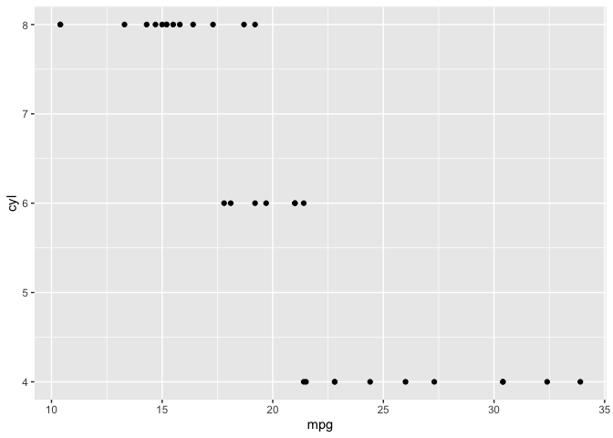

<!-- README.md is generated from README.Rmd. Please edit that file -->

# figpatch

<!-- badges: start -->
<!-- badges: end -->

The goal of figpatch is to create an easy way to incorporate external
figures and images into figures assembled with
[{patchwork}](https://patchwork.data-imaginist.com/).

## Installation

<!-- You can install the released version of figpatch from [CRAN](https://CRAN.R-project.org) with: -->
<!-- ``` r -->
<!-- install.packages("figpatch") -->
<!-- ``` -->

Install the development version from [GitHub](https://github.com/) with:

``` r
# install.packages("devtools")
devtools::install_github("BradyAJohnston/figpatch")
```

## Example

This is a basic example which shows you how to solve a common problem:

``` r
library(figpatch)
library(ggplot2)
library(patchwork)
```

To use images inside of a patchwork object, they need to be converted to
a `{ggplot}` object via `fig()`. Once converted, you can assemble the
`{patchwork}` as you would otherwise with `+ / - * &` or
`patchwork::wrap_plots()`.

``` r
img <- fig("data/fig.png")
plt <- ggplot(mtcars) + 
  aes(mpg, cyl) + 
  geom_point()

pat <- patchwork::wrap_plots(img, plt)
pat
```


Depending on how you want things labelled, the patchwork labelling not
arrange things how you would like.

``` r
pat + plot_annotation(tag_levels = "A", 
                      tag_prefix = "(", tag_suffix = ")",
                      theme = theme(plot.background = element_rect(colour = "black"))
)
```


``` r
wrap_plots(list(figpatch::figlab(img, "(A)", 
                             fontsize = 16, 
                             colour = "gray30"), plt))
```


``` r
pat <- wrap_plots(list(plt, figlab(img, "(A)", colour = "gray20"),plt,  figlab(img, "(B)", colour = "gray20")))
pat
```



``` r
wrap_plots(list(img, img, img, img, img, img, img, img, img), nrow = 3) + 
  plot_annotation(tag_levels = "A")
```


