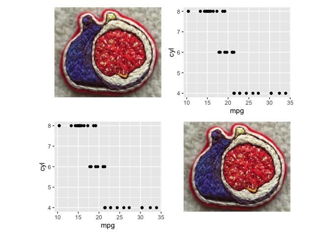
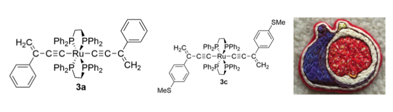

<!-- README.md is generated from README.Rmd. Please edit that file -->

# figpatch

<!-- badges: start -->
<!-- badges: end -->

The goal of figpatch is to create an easy way to incorporate external
figures and images into figures assembled with
[{patchwork}](https://patchwork.data-imaginist.com/).

## Installation

<!-- You can install the released version of figpatch from [CRAN](https://CRAN.R-project.org) with: -->
<!-- ``` r -->
<!-- install.packages("figpatch") -->
<!-- ``` -->

Install the development version from [GitHub](https://github.com/) with:

``` r
# install.packages("devtools")
devtools::install_github("BradyAJohnston/figpatch")
```

## Example

``` r
library(figpatch)
library(ggplot2)
library(patchwork)
```

To use images inside of a patchwork object, they need to be converted to
a `{ggplot}` object via `fig()`. Once converted, you can assemble the
`{patchwork}` as you would otherwise with `+ / - * &` or
`patchwork::wrap_plots()`.

``` r
img <- fig("inst/extdata/fig.png")

plt <- ggplot(mtcars) + 
  aes(mpg, cyl) + 
  geom_point() + 
  theme(plot.tag = element_text(hjust = 0, 
                                vjust = 1))

pat <- patchwork::wrap_plots(img, plt, plt, img)
pat
```



Patchwork already provides support for quick labelling of sub-plots and
sub-figures using `patchwork::plot_annotation()`.

``` r
pat + plot_annotation(tag_levels = "A")
```


For figures which are all just images, labelling *on top* of the image
is sometimes desired. {patchwork} currently utilises the ggplot `tag`
option from `ggplot2::labs(tag = ...)` but which currently [doesn’t
support tagging inside plot
borders.](https://github.com/tidyverse/ggplot2/issues/4297).

#### The assembled patchwork.

``` r
knitr::opts_chunk$set(fig.height = 2, fig.width = 7)
```

``` r
patchwork::wrap_plots(img, img, img, nrow = 1)
```


### The default tagging behaviour.

``` r
patchwork::wrap_plots(img, img, img, nrow = 1) + 
  plot_annotation(tag_levels = "A")
```


### Manually Tagging

A current solution to this is the `figlab()` function which will add a
supplied tag to the supplied fig.

``` r
img1 <- figlab(img, "A")
img2 <- figlab(img, "(B)")
img3 <- figlab(img, "misc")

patchwork::wrap_plots(img1, img2, img3, nrow = 1)
```


A number of default positions are available, as well as support for
custom `x & y` coordinates.

``` r
img1 <- figlab(img, "A", pos = "topright")
img2 <- figlab(img, "(B)", pos = "bottomleft")
img3 <- figlab(img, "misc", pos = c(0.4, 0.9))

patchwork::wrap_plots(img1, img2, img3, nrow = 1)
```



## `figwrap()`

To quickly label and wrap multiple figures, use `figwrap()`

To add borders around indiviual figures, use `b_*` options inside of
`figwrap()` or also inside `fig()`.

``` r
figwrap(list(img, img, img), "A", prefix = "(", suffix = ")", b_col = "black")
```


``` r
knitr::opts_chunk$set(fig.height = 5, fig.width = 7)
```

Assembling lots of figures.

``` r
figs <- lapply(1:9, function(x) img)

figwrap(figs, nrow = 3, labelling = 1, suffix = ")", b_col = "gray20", b_size = 2)
```


## Adding specific sub-plot text.

At the end of the day, each of the figs is just a `ggplot()` object, so
axis labels can be used to add text below and above. Designs in
`patchwork` can also be used to arrange the figures specifically.

``` r
img1 <- img1 + labs(x = "A label below the fig.")

img2 <- img2 + labs(x = "An italic label below the fig.") + 
  theme(axis.title.x = element_text(face = "italic"))
  

design <- "AB
           CC"

patchwork::wrap_plots(img1, img2, img3, design = design)
```


