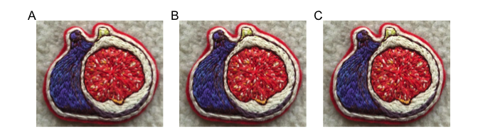

<!-- README.md is generated from README.Rmd. Please edit that file -->

# figpatch

<!-- badges: start -->

[](https://lifecycle.r-lib.org/articles/stages.html#experimental)
[](https://CRAN.R-project.org/package=figpatch)
<!-- badges: end -->

The goal of figpatch is to create an easy way to incorporate external
figures and images into figures assembled with
[{patchwork}](https://patchwork.data-imaginist.com/).

## Installation

You can install the released version of figpatch from
[CRAN](https://CRAN.R-project.org) with:

``` r
install.packages("figpatch")
```

Install the development version from [GitHub](https://github.com/) with:

``` r
# install.packages("devtools")
devtools::install_github("BradyAJohnston/figpatch")
```

## Example

``` r
library(figpatch)
library(ggplot2)
library(patchwork)
```

To use images inside of a patchwork object, they need to be converted to
a `{ggplot}` object via `fig()`. Once converted, you can assemble the
`{patchwork}` as you would otherwise with `+ / - * &` or `wrap_plots()`.

``` r
image_path <- system.file(
  "extdata", 
  "fig.png", 
  package = "figpatch", 
  mustWork = TRUE)

img <- fig(image_path)

plt <- ggplot(mtcars) + 
  aes(mpg, cyl) + 
  geom_point()

wrap_plots(img, plt, plt, img)
```


The `aspect.ratio` of the figs is set to the dimensions of the image,
but the plots can still resize as you would expect. For each plot that
aligns with a fig, it’s dimensions will match that of the fig (as
above). If however it only aligns on one axis, then the other is free to
resize to fill up the total image space (as below).

``` r
wrap_plots(plt, img, plt, img, ncol = 2)
```


If for some reason you want your fig to also resize (and thus distort
your image) then you can specify a particular `aspect.ratio` or let it
*be free!*

``` r
free_fig <- fig(image_path, aspect.ratio = "free")

wrap_plots(free_fig, plt, ncol = 1)
```


*Elegant.*

### Tagging

Patchwork already provides support for easy tagging of sub-plots and
sub-figures using `plot_annotation()`.

``` r
wrap_plots(img, plt, plt, img) + 
  plot_annotation(tag_levels = "A")
```


For a lot of figures that include images, tags should be placed on top
of the images themselves. Tagging in {patchwork} currently utilises the
ggplot `tag` option from `ggplot2::labs(tag = ...)` but which currently
[doesn’t support tagging inside plot
borders.](https://github.com/tidyverse/ggplot2/issues/4297)

Lets see how it plays out.

#### The assembled figs

``` r
knitr::opts_chunk$set(fig.height = 2, fig.width = 7)
```

``` r
patchwork::wrap_plots(img, img, img, nrow = 1)
```


### Scaling the Figs

If multiple figs have differing dimensions, but but should be scaled the
same, you can use `fig_scale()` to scale them all to the maximum width
and height of all of the included figs.

#### Without scaling

``` r
fl <- image_path <- system.file("extdata",
                                package = "figpatch",
                                mustWork = TRUE) %>%
  list.files(pattern = "png",
             full.names = TRUE)

fl %>% 
  lapply(fig) %>% 
  fig_wrap(ncol = 3)
```


#### With Scaling

``` r
fl %>% 
  lapply(fig) %>% 
  fig_scale() %>% 
  fig_wrap(ncol = 3)
```


The scaling is based on the number of pixels, so while the two chemical
structures are now properly scaled, the fig has been reduced
significantly.

We can scale them independently to keep the third fig bigger.

``` r
scaled_strctures <- lapply(fl[1:2], fig) %>% 
  fig_scale()

fig_wrap(c(scaled_strctures, list(fig(fl[3]))))
```


### {patchwork} tagging the figs

``` r
patchwork::wrap_plots(img, img, img, nrow = 1) + 
  plot_annotation(tag_levels = "A")
```



### {figpatch} tagging the figs

To add internal tags to the figs, use the `fig_tag()` function.
Assembling with {patchwork} can continue as normal.

``` r
img1 <- fig_tag(img, "A")
img2 <- fig_tag(img, "(B)")
img3 <- fig_tag(img, "misc")

patchwork::wrap_plots(img1, img2, img3, nrow = 1)
```


A number of default positions can be supplied to `fig_tag(pos = ...)` or
a custom vector which will place the text in `npc` coordinates (0 to 1
for both `x` and `y`) and automatically adjust for the aspect ratio of
the fig.

``` r
img1 <- fig_tag(img, "A", pos = "topright")
img2 <- fig_tag(img, "(B)", pos = "bottomleft")
img3 <- fig_tag(img, "misc", pos = c(0.4, 0.9))

wrap_plots(img1, img2, img3, nrow = 1)
```


## `fig_wrap()`

To quickly label and wrap multiple figures, use `fig_wrap()`

To add borders around individual figures, use `b_*` options inside of
`fig_wrap()` or specify them individually with `fig()`.

``` r
fig_wrap(
  list(img, img, img),
  "A",
  prefix = "(",
  suffix = ")",
  b_col = "black"
)
```


Assembling lots of figures.

``` r
knitr::opts_chunk$set(fig.height = 5, fig.width = 7)
```

``` r
figs <- lapply(1:9, function(x) img)

fig_wrap(
  figs,
  nrow = 3,
  tag = 1,
  suffix = ")",
  b_col = "gray20",
  b_size = 2
)
```


Adjust the padding around plots with `b_margins` and change the unit
used with `b_unit`.

``` r
fig_wrap(
  figs,
  nrow = 3,
  tag = 1,
  suffix = ")",
  b_col = "gray20",
  b_size = 2, 
  b_margin = ggplot2::margin(8, 8, 8, 8)
)
```


## Adding specific sub-plot text

You can add labels to the text using the `fig_lab()` function. Some
customisations are available. At the end of the day, a `fig()` is just a
`ggplot` object, and the labels are just the axis titles (x or y). You
can add your own `theme()` elements to customise further.

``` r
img1 <- fig_lab(img1, "Above is a fig.")

img2 <- fig_lab(img2, "This is an italic label.", fontface = "italic")

img3 <- fig_lab(img3, "Below is a fig.", pos = "top")

design <- "AB
           CC"

wrap_plots(img1, img2, img3, design = design)
```


